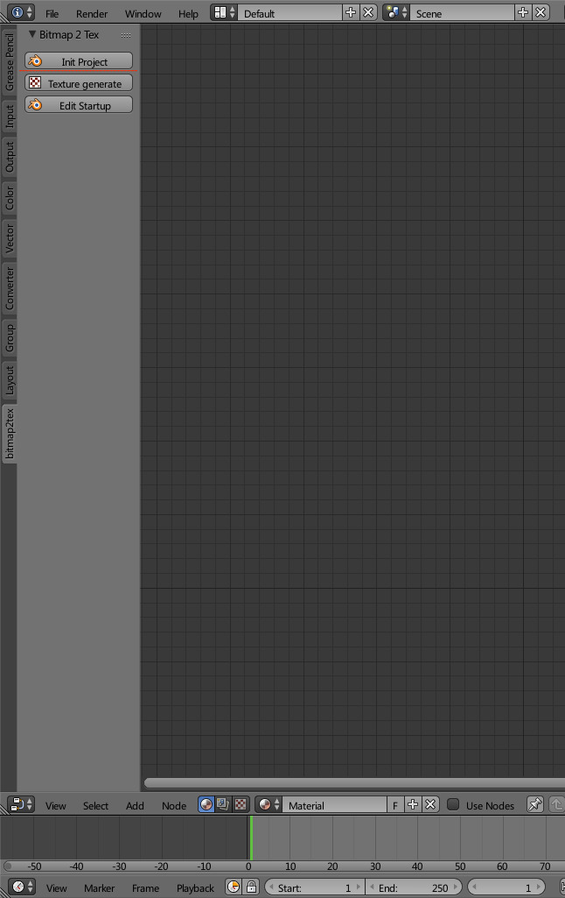
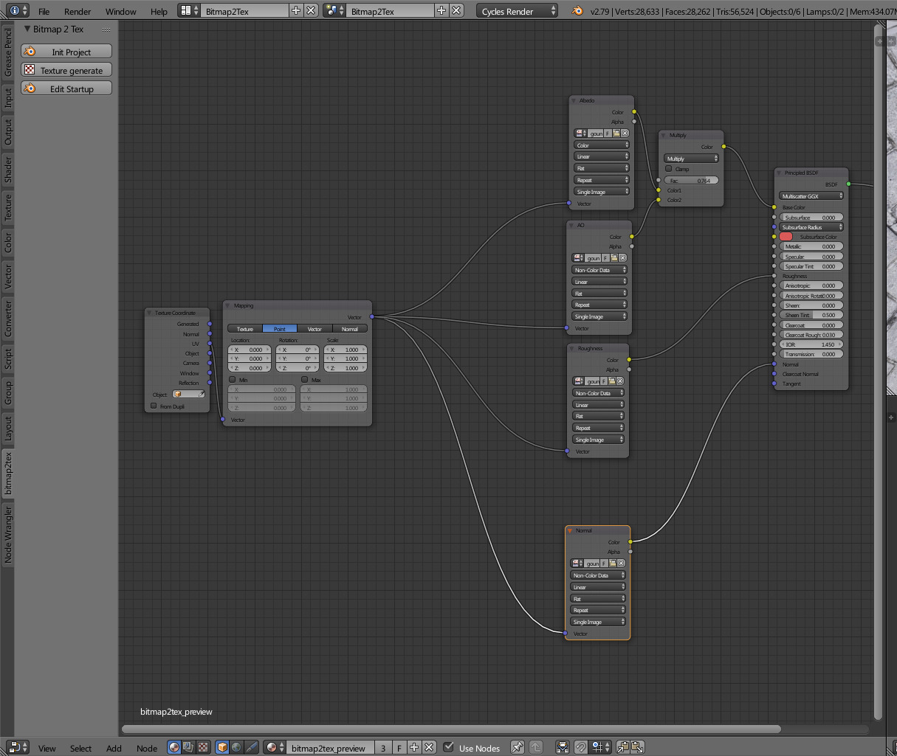
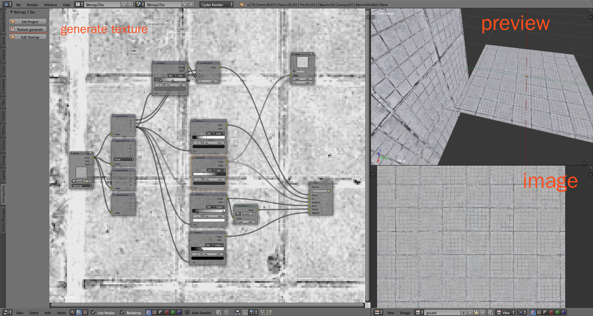

bitmap2tex is a blender addon.  
use blender as pbr texture genarater.

## usage
composition workflow
1. init project
2. save blend file
3. edit bitmap image
4. adjust material
5. adjust composition
6. texture generate
7. adjust texture
8. regenerate texture

## todo
- wait for blender 2.8 eevee
- material node bake workflow
- bitmap2tex node system
